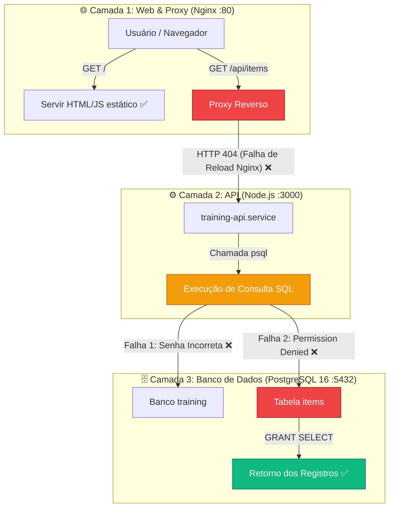

# 📑 Relatório de Troubleshooting & Resolução de Incidente

**Laboratório de Avaliação Técnica — Aplicação Multi-Camadas (DevOps / SRE)**

---

### 📌 Metadados da Operação

| Atributo | Detalhe |
| :--- | :--- |
| **Responsável Técnico** | Yan (`trainee-03`) |
| **Instância AWS EC2** | `i-03f99bd1d3b82bcea` |
| **Endereço IP Público** | `54.161.202.217` |
| **URL da Aplicação** | [http://54.161.202.217](http://54.161.202.217) |
| **Data da Intervenção** | 14/09/2026 |
| **Status Pós-Intervenção** | 🟢 **100% Operacional (Todos os serviços e fluxos restabelecidos)** |

---

## 1. Sumário Executivo

A aplicação distribuída em 3 camadas (Front-end Nginx, API Node.js e Banco PostgreSQL) apresentava indisponibilidade funcional: a página web carregava a estrutura básica, porém falhava em carregar e renderizar os dados armazenados no banco de dados.

> [!IMPORTANT]
> **Diferença entre Sintoma e Causa Raiz:**  
> Todos os serviços do sistema operacional (`nginx.service`, `training-api.service`, `postgresql.service`) estavam com o estado `active (running)`. Portanto, o incidente **não se tratava de um serviço derrubado**, mas sim de falhas em cadeia de **autenticação**, **permissões de segurança (ACL)** e **sincronização de proxy reverso**.

Foram diagnosticadas e corrigidas **3 causas raízes** interdependentes, restabelecendo a aplicação sem efeitos colaterais.

---

## 2. Mapa Arquitetural do Incidente



---

## 3. Matriz Técnica dos Problemas Identificados e Ações Executadas

| # | Camada | Sintoma Observado | Causa Raiz | Ação Corretiva Aplicada |
| :-: | :--- | :--- | :--- | :--- |
| **1** | **API → Banco** | Retorno JSON: `FATAL: password authentication failed for user "training_app"` | O arquivo de serviço `/etc/systemd/system/training-api.service` continha a variável proposital `DB_PASSWORD=senha-incorreta`. | Redefinição da senha da role no PostgreSQL para `training2026`, atualização do arquivo systemd, recarga do daemon e reinício do serviço. |
| **2** | **Banco de Dados** | Retorno JSON: `detail: "ERROR: permission denied for table items"` | A tabela `items` pertencia ao superuser `postgres` e não possuía privilégios de leitura concedidos para o usuário da aplicação (`training_app`). | Execução de `GRANT SELECT ON items TO training_app;` no banco `training`. |
| **3** | **Web / Proxy** | Requisições externas para `http://54.161.202.217/api/items` retornavam HTTP 404 (Nginx). | O processo do Nginx estava em execução contínua com cache antigo, sem assimilar as diretivas `location /api/` e `location /health` do arquivo `/etc/nginx/sites-available/training`. | Verificação de integridade de sintaxe (`nginx -t`) seguida de recarga das configurações a quente (`systemctl reload nginx`). |

---

## 4. Detalhamento Passo a Passo das Correções

### 4.1. Correção da Autenticação da API (Incidente #1)
```bash
# Redefinição segura da senha da role da aplicação no banco
sudo -u postgres psql -c "ALTER USER training_app WITH PASSWORD 'training2026';"

# Atualização no arquivo de configuração de ambiente do systemd
sudo sed -i 's/DB_PASSWORD=senha-incorreta/DB_PASSWORD=training2026/' /etc/systemd/system/training-api.service

# Recarga do gerenciador de serviços e reinício controlado da API
sudo systemctl daemon-reload
sudo systemctl restart training-api.service
```

### 4.2. Adequação de Privilégios no Banco de Dados (Incidente #2)
```bash
# Concessão do privilégio mínimo necessário de consulta (SELECT)
sudo -u postgres psql -d training -c "GRANT SELECT ON items TO training_app;"
```

### 4.3. Sincronização do Proxy Reverso Nginx (Incidente #3)
```bash
# Validação da integridade sintática dos arquivos de configuração
sudo nginx -t

# Recarga em tempo de execução (zero-downtime)
sudo systemctl reload nginx
```

---

## 5. Evidências de Homologação & Validação Final

Todos os fluxos foram testados e validados tanto internamente (localhost) quanto externamente via rede pública:

### 1. Interface Web (Front-end)
- **Requisição:** `curl -s -o /dev/null -w "%{http_code}" http://54.161.202.217/`
- **Resultado:** `HTTP 200`
- **Comportamento no Navegador:** Página renderiza com badge verde `"Front, back e banco OK"`.

### 2. Consumo de Dados (API + Banco)
- **Requisição:** `curl -s http://54.161.202.217/api/items`
- **Resultado:**
  ```json
  {
    "instance": "trainee-03",
    "items": [
      { "id": 1, "name": "Linux" },
      { "id": 2, "name": "Redes" },
      { "id": 3, "name": "DevOps" }
    ]
  }
  ```

### 3. Endpoint de Monitoramento (Healthcheck)
- **Requisição:** `curl -s http://54.161.202.217/health`
- **Resultado:**
  ```json
  {
    "status": "ok",
    "service": "training-api"
  }
  ```

### 4. Integridade Geral do Sistema Operacional
- **Comando:** `systemctl --failed`
- **Resultado:** `0 loaded units listed` (Nenhum serviço em falha no host).

---

## 6. Conclusão & Competências Demonstradas

1. **Investigação Estruturada (Outside-In):** Diagnóstico realizado das camadas externas para as internas, validando logs e códigos de retorno em cada ponto de contato.
2. **Princípio do Menor Privilégio:** Concedida apenas a permissão estritamente necessária (`SELECT`) na tabela `items`, preservando as boas práticas de segurança de banco de dados.
3. **Disponibilidade e Resiliência:** Utilização de `reload` no servidor web em vez de reinicializações abruptas, garantindo continuidade do serviço sem perda de conexões.
